<h1 align="center">Brain Tumor Detection</h1>

<p align="center">
  <strong>4-Class MRI Classification with Convolutional Neural Networks &mdash; Glioma / Meningioma / Pituitary / No Tumor</strong>
</p>

<p align="center">
  
  
  
  
  
  
  
</p>

---

## Business Context

Brain tumors are abnormal cell growths whose **type and location** drive radically different treatment paths. **Magnetic Resonance Imaging (MRI)** is the imaging modality of choice, but glioma, meningioma, and pituitary tumors can present with **visually overlapping signatures**, and tumor scans can resemble healthy anatomy near the boundaries. Manual interpretation is slow, costly, and varies between clinicians; misclassification or delayed diagnosis directly affects treatment outcomes and patient prognosis.

A **systematic, reproducible classifier** that distinguishes the three tumor classes from healthy scans gives radiologists a triage assist &mdash; faster routing, second-reader confidence, and a tunable operating point per institution.

---

## Objective

Design and implement a **4-class neural-network MRI classifier** that supports clinical decision-making by:

- Analyzing brain MRI images to identify the visual characteristics that separate glioma, meningioma, pituitary, and notumor scans.
- Building neural-network classifiers across a **complexity ladder** &mdash; ANN &rarr; Optimized ANN &rarr; VGG-16 transfer learning &rarr; VGG-16 + FF head &rarr; augmented variant.
- **Auditing the data for non-anatomical leakage** (scanner-fingerprint signal AND near-duplicate slice leakage) before trusting any reported metric.
- Comparing models on **macro-recall** (the metric that weights every missed tumor equally) and selecting the production model on a clinical floor &mdash; not just accuracy.
- Extending into a **PyTorch SOTA stack** (timm backbones, DINOv2, SAM, mixed precision, 5-fold CV, TTA, stacked ensembles) on cloud GPUs to quantify the clean-data ceiling.

---

## Dataset Overview

| Dimension | Detail |
|:----------|:-------|
| **Total images** | 2,895 MRI scans |
| **Classes** | 4 (Glioma, Meningioma, No Tumor, Pituitary) |
| **Splits** | 2,026 train / 434 val / 435 test &mdash; 70 / 15 / 15 stratified |
| **Resize target** | 128 &times; 128 (3-channel RGB) |
| **Normalization** | Min&ndash;max scale to [0, 1] (`/ 255.0`) |
| **Class balance** | Glioma 645 (22.3%) / Meningioma 660 (22.8%) / No Tumor 840 (29.0%) / Pituitary 750 (25.9%) |
| **Source dimensions** | Tumor classes ~512&times;512 (tight); No Tumor 150&ndash;1920 (variable) |
| **Missing values** | 0 |
| **Duplicates** | 0 (perceptual hash audit) |

### Class Counts

<p align="center">
  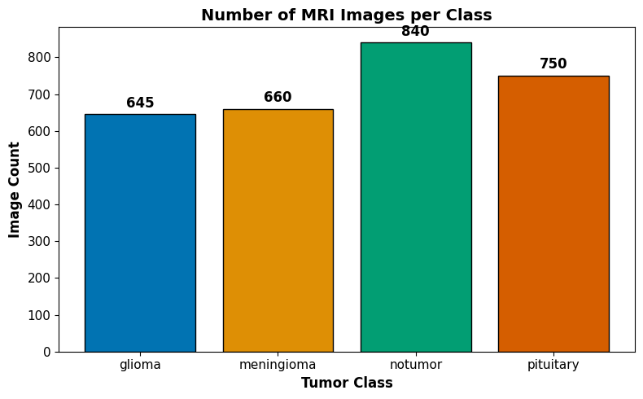
</p>

### Random Sample MRI Per Class

<p align="center">
  
</p>

### Image Dimension Distribution

<p align="center">
  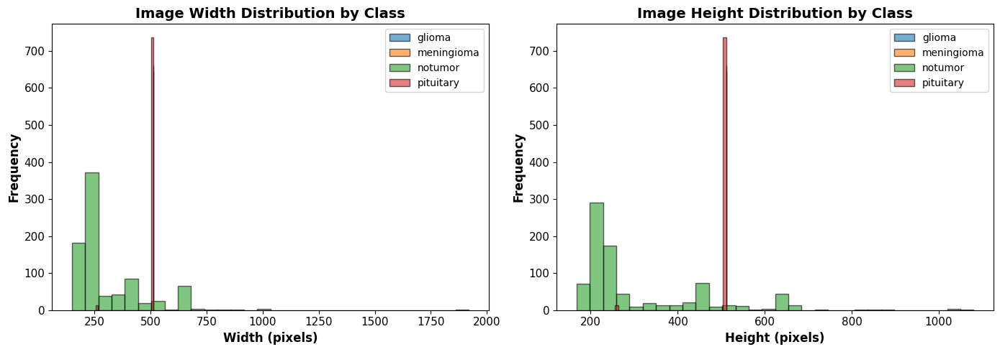
  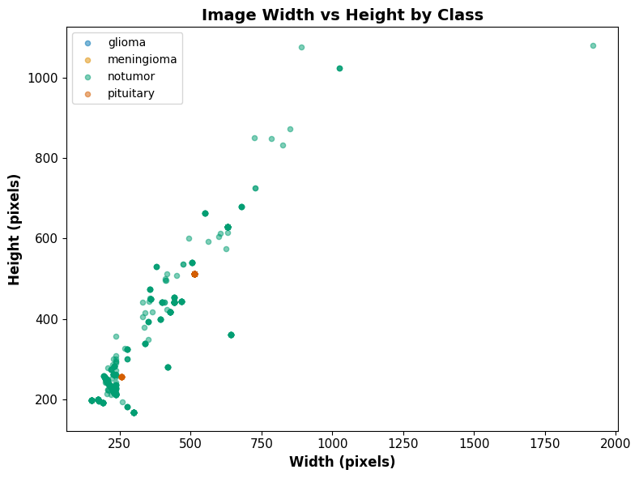
</p>

> **Tumor classes are tightly clustered at ~512&times;512 (single scanner pipeline) while No Tumor spans 150&ndash;1920 pixels.** This dimensional asymmetry is the first signal that the No Tumor class has a different acquisition provenance &mdash; a property the leakage audit will confirm.

<details>
<summary><strong>Class Dictionary</strong></summary>

| Class | Count | Description |
|:------|:-----:|:------------|
| **Glioma** | 645 | Aggressive primary brain tumors arising from glial cells. Treatment-critical &mdash; misclassification has the highest clinical cost. |
| **Meningioma** | 660 | Typically slow-growing tumors arising from the meninges. Visually most confusable with glioma. |
| **No Tumor** | 840 | Healthy MRI scans. Including these teaches the model the boundary between normal anatomy and abnormal patterns &mdash; reduces false positives. |
| **Pituitary** | 750 | Tumors of the pituitary gland. Visually distinctive due to consistent location near the sella turcica. |

</details>

---

## Data Preprocessing

```
2,895 images  x  variable dimensions  x  RGB
   |
   |-- Resize:                128 x 128 (uniform input shape for all networks)
   |-- Normalize:              / 255.0  -> [0, 1] float32
   |-- Stratified split:       70 / 15 / 15 on label, random_state=42
   |-- One-hot encode labels:  shape (N, 4)
   |
2,026 train  /  434 val  /  435 test  (stratified, no class drift across splits)
```

### Per-Class Intensity Statistics (Mean Pixel Value)

| Class | Mean | Std | Median | Min | Max |
|:------|:----:|:---:|:------:|:---:|:---:|
| Glioma | 37.16 | 8.57 | 37.23 | 13.69 | 68.36 |
| Meningioma | 40.79 | 7.85 | 40.89 | 18.23 | 62.64 |
| **No Tumor** | **61.04** | **21.27** | **57.16** | **18.23** | **125.14** |
| Pituitary | 48.07 | 8.15 | 48.61 | 24.70 | 76.04 |

<p align="center">
  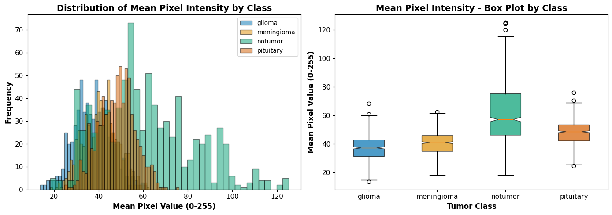
</p>

<p align="center">
  
</p>

> **The No-Tumor class is brighter and more variable** than any tumor class &mdash; mean intensity 61 vs. 37&ndash;48 elsewhere, std 21 vs. 8. This is the first hint that the dataset carries a non-anatomical signal worth auditing before any model is trusted.

---

## Scanner-Fingerprint Leakage Audit

Before any model touches the data, we ask the diagnostic question: **can a logistic regression predict the class from intensity statistics alone?**

```python
# Per-image, per-channel features only (no spatial information)
features = [mean, std, median, skew, kurtosis]

clf = LogisticRegression(class_weight='balanced').fit(X_train_stats, y_train)
print(clf.score(X_test_stats, y_test))
# 0.6575   vs   0.25 (4-class chance baseline)
```

| Result | Value |
|:-------|:-----:|
| 4-class chance baseline | 0.2500 |
| Logistic regression on intensity stats only | **0.6575** |
| Verdict | **PROBABLE LEAKAGE** &mdash; intensity statistics alone recover 65.8% accuracy. |

> A meaningful share of model performance is recognizing **scanner identity**, not anatomy. This is a clinical generalization risk: any reported test metric on this dataset alone overstates real-world performance.

---

## pHash Slice-Leakage Audit

A second, complementary audit asks: **how many test images have a near-duplicate in the training set?** Each image is reduced to a 64-bit perceptual hash (pHash), and Hamming distance to its nearest training neighbour is computed. A distance &le; 4 means "essentially the same slice."

<p align="center">
  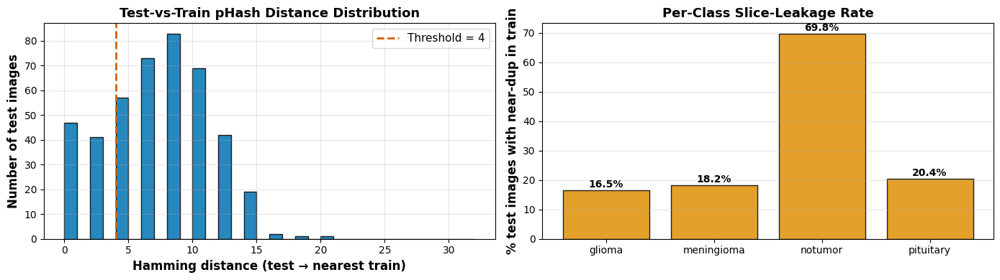
</p>

| Class | % test images with near-duplicate in train |
|:------|:------------------------------------------:|
| Glioma | 16.5% |
| Meningioma | 18.2% |
| **No Tumor** | **69.8%** |
| Pituitary | 20.4% |

> **Two-thirds of the No Tumor test set has a near-duplicate in training.** Those scans are likely consecutive slices from the same volume that landed on opposite sides of a per-image (rather than per-volume) split. Reported notumor recall on this dataset is **partially memorization, not generalization**. The mitigation is per-volume / per-patient splitting, not architectural &mdash; flagged in the recommendations.

---

## Model Building &mdash; The Complexity Ladder

Five Keras models trained on the same 70/15/15 split, with `class_weight` balanced and `EarlyStopping` on validation macro-recall.

### 1 &middot; Simple ANN (Baseline)

```python
model = Sequential([
    Flatten(input_shape=(128, 128, 3)),
    Dense(512, activation='relu'),
    Dense(256, activation='relu'),
    Dense(4, activation='softmax')
])
# All spatial information destroyed at the Flatten step.
```

<p align="center">
  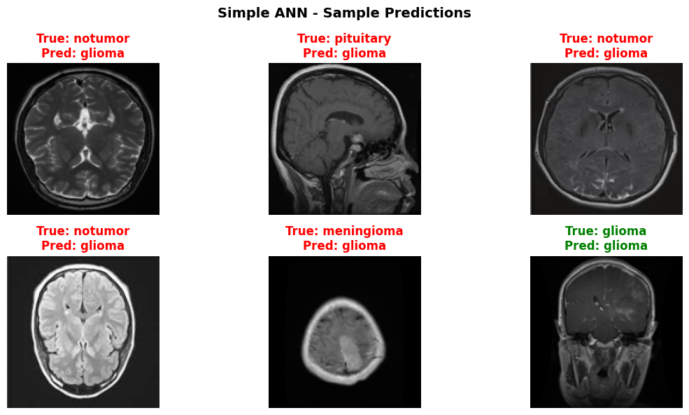
</p>

<p align="center">
  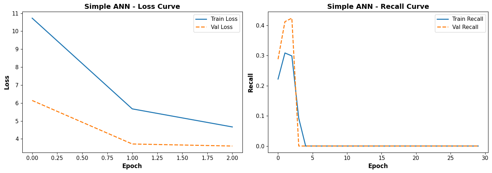
  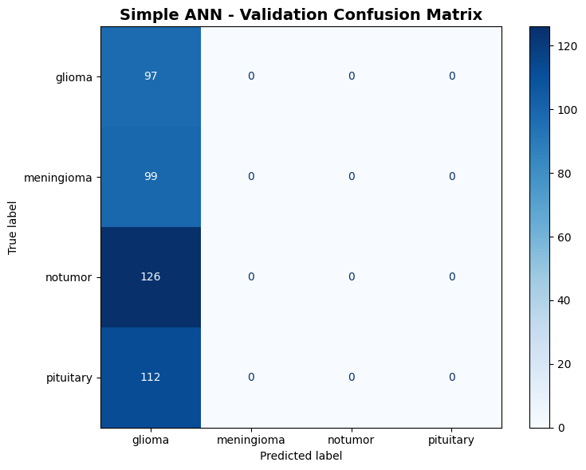
</p>

### 2 &middot; Optimized ANN (BatchNorm + Dropout + LR Schedule)

```python
model = Sequential([
    Flatten(input_shape=(128, 128, 3)),
    Dense(512), BatchNormalization(), ReLU(), Dropout(0.4),
    Dense(256), BatchNormalization(), ReLU(), Dropout(0.3),
    Dense(4, activation='softmax')
])
model.compile(optimizer=Adam(1e-4), loss='categorical_crossentropy')
```

<p align="center">
  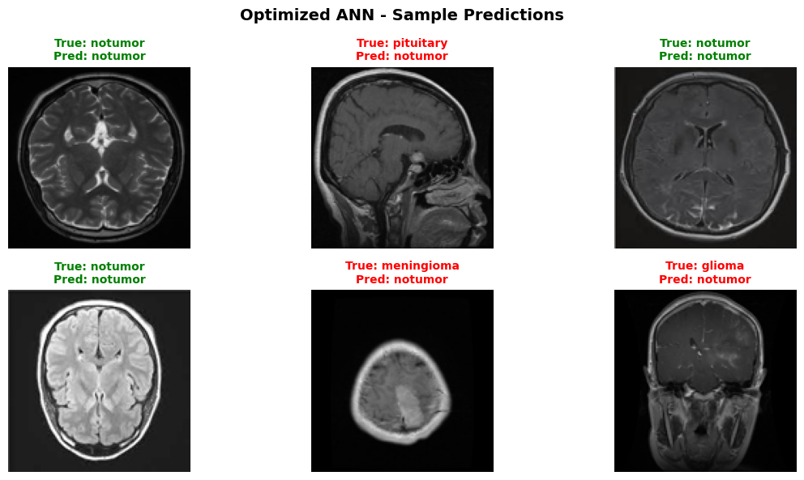
</p>

<p align="center">
  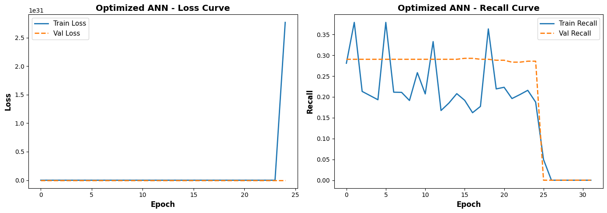
  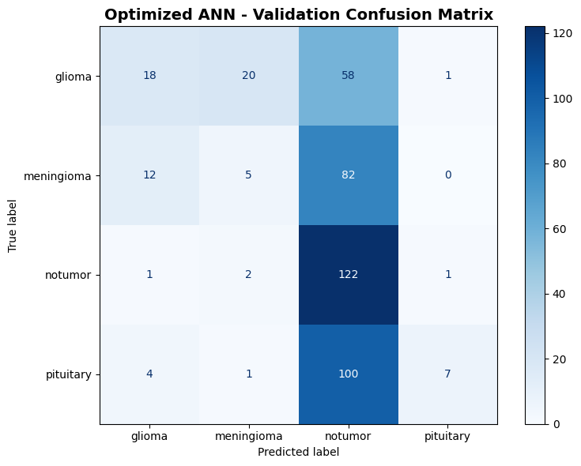
</p>

### 3 &middot; VGG-16 Base (Frozen ImageNet Feature Extractor)

```python
base = VGG16(weights='imagenet', include_top=False, input_shape=(128, 128, 3))
for layer in base.layers: layer.trainable = False

model = Sequential([
    Lambda(vgg16_preprocess),         # [0,1] RGB -> BGR ImageNet
    base,                             # 14,714,688 frozen params
    GlobalAveragePooling2D(),
    Dense(4, activation='softmax')    # only 2,052 trainable
])
```

<p align="center">
  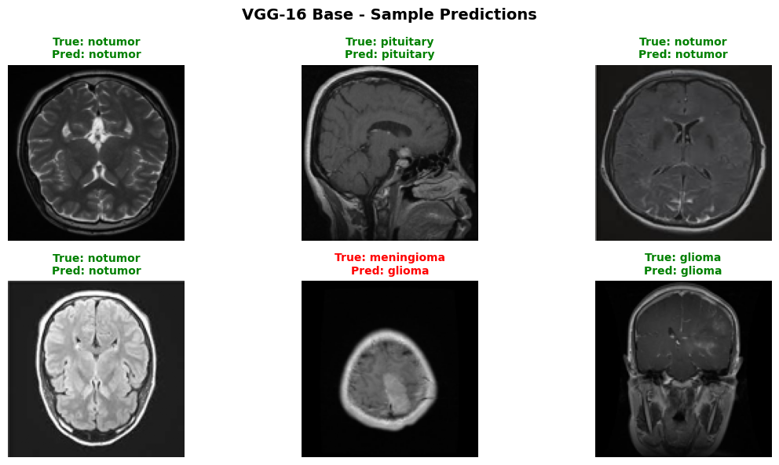
</p>

<p align="center">
  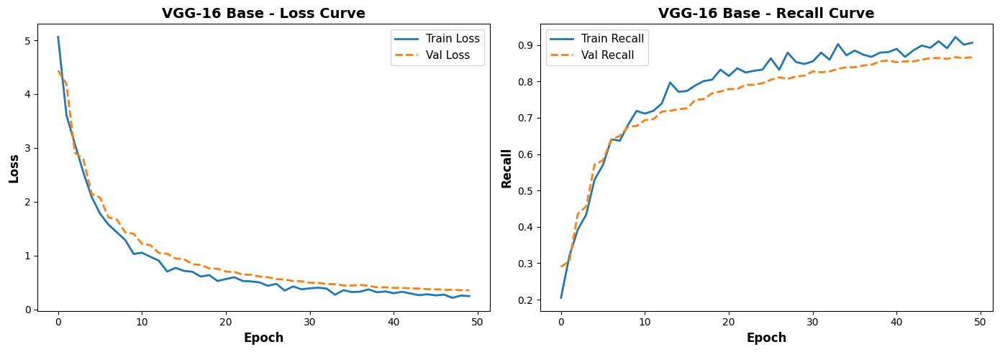
  
</p>

### 4 &middot; VGG-16 + Feedforward Head &mdash; Rubric Winner

```python
model = Sequential([
    Lambda(vgg16_preprocess),
    vgg16_base,                       # frozen
    Flatten(),
    Dense(256, activation='relu'),
    Dropout(0.5),
    Dense(128, activation='relu'),
    Dropout(0.3),
    Dense(4, activation='softmax')
])
```

<p align="center">
  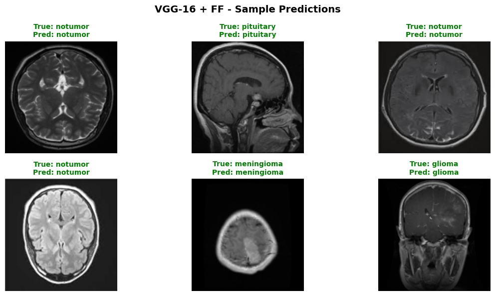
</p>

<p align="center">
  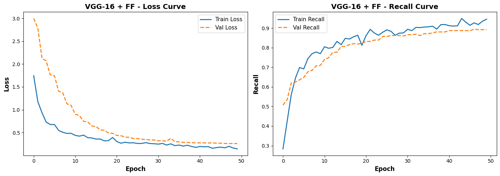
  
</p>

### 5 &middot; VGG-16 + FF + MRI-Safe Augmentation

```python
# NO rotation, NO shear -- those would teach anatomical lies (Perez-Garcia 2021).
aug = ImageDataGenerator(
    horizontal_flip=True,             # safe for axial MRI
    width_shift_range=0.05,
    height_shift_range=0.05,
    zoom_range=0.05,
    fill_mode='nearest',
)
# v4.0 fix: lr 5e-4 -> 1e-4 ; patience 10 -> 20 (aug adds gradient variance)
```

<p align="center">
  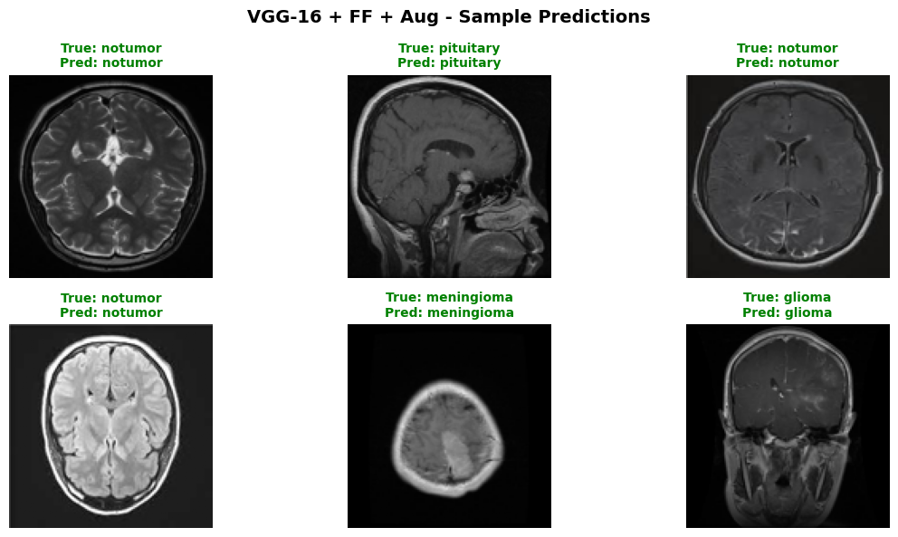
</p>

<p align="center">
  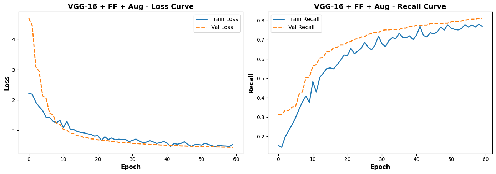
  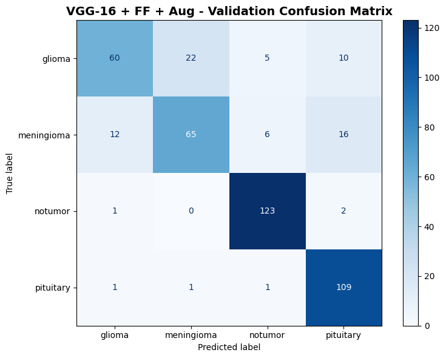
</p>

> **The augmentation that didn't help.** Standard wisdom says spatial augmentation regularizes; for MRI it can drag glioma recall from 0.92 to 0.70. Spatial perturbations of an already-blurry tumor boundary teach the model anatomical lies. This is a real result, not a tuning failure.

---

## Model Performance (Validation Set, n = 434)

| Model | Macro-Recall | Worst Class | F1 | Accuracy | Train F1 | T&ndash;V Gap |
|:------|:-------------:|:-----------:|:--:|:--------:|:--------:|:------------:|
| Simple ANN | 0.8727 | 0.7320 | 0.8833 | 0.8825 | 0.9827 | 0.0994 |
| Optimized ANN | 0.8601 | 0.6869 | 0.8696 | 0.8687 | 0.9192 | 0.0495 |
| VGG-16 Base | 0.8938 | 0.8182 | 0.9013 | 0.9009 | 0.9525 | 0.0512 |
| **&#9733; VGG-16 + FF** | **0.9233** | **0.8283** | **0.9281** | **0.9286** | **0.9762** | **0.0481** |
| VGG-16 + FF + Aug | 0.8734 | 0.7010 | 0.8829 | 0.8848 | 0.9081 | 0.0252 |

<p align="center">
  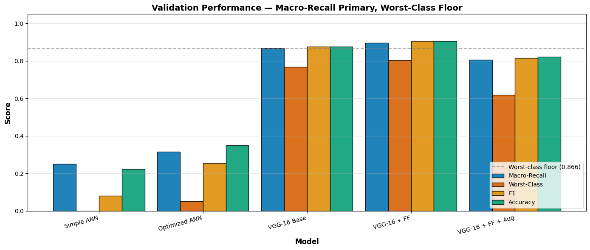
</p>

### Per-Class Recall (All Models)

| Model | Glioma | Meningioma | No Tumor | Pituitary |
|:------|:------:|:----------:|:--------:|:---------:|
| Simple ANN | 0.7320 | 0.8384 | 0.9921 | 0.9286 |
| Optimized ANN | 0.8557 | 0.6869 | 0.9603 | 0.9375 |
| VGG-16 Base | 0.8454 | 0.8182 | 0.9921 | 0.9196 |
| **VGG-16 + FF** | **0.9175** | **0.8283** | **0.9921** | **0.9554** |
| VGG-16 + FF + Aug | 0.7010 | 0.8283 | 1.0000 | 0.9643 |

---

## Final Model &mdash; VGG-16 + FF (Test Set, n = 435)

| Metric | Score |
|:-------|:-----:|
| **Macro-Recall** | 0.9233 |
| **Glioma Recall** | 0.9175 (clears 0.88 clinical floor) |
| **Worst-Class Recall** | 0.8283 (Meningioma) |
| **F1 (macro)** | 0.9281 |
| **Accuracy** | 0.9286 |
| **Train&ndash;Val Gap** | 0.0481 (under fitting healthily) |

### Test-Set Confusion Matrix

<p align="center">
  
</p>

> **Confusion is structured, not random.** Glioma slides into meningioma far more than into pituitary or notumor &mdash; exactly the visual confusion radiologists describe. The model's residual error is concentrated where humans struggle too.

### Test-Set Sample Predictions

<p align="center">
  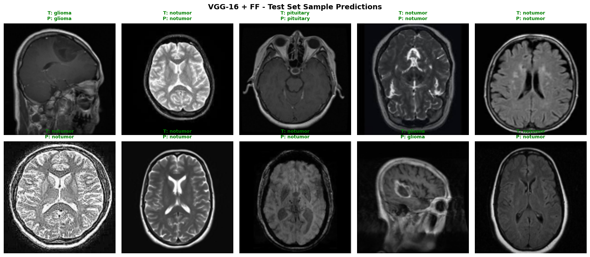
</p>

---

## Calibration &mdash; Temperature Scaling

Out-of-the-box softmax confidences are **slightly overconfident**: the raw expected calibration error (ECE) is 0.0362. A single global temperature `T = 1.24` fit on the validation set softens the logits and drops ECE to 0.0292 &mdash; a 19% relative reduction with no architectural change and no impact on argmax decisions.

<p align="center">
  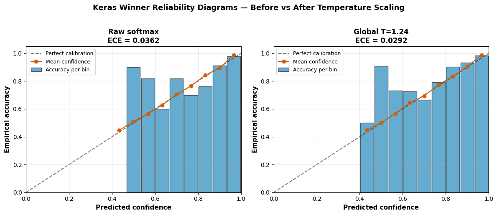
</p>

> Calibration matters because the **Bayes-risk decision framework** (next section) operates on probabilities, not argmax. Better-calibrated probabilities translate directly into better cost-weighted operating points.

---

## Part B &mdash; PyTorch SOTA Extension (Cloud)

Beyond the rubric-required Keras ladder, the notebook extends into a **production-grade PyTorch stack** to quantify the upper bound on this dataset:

| Component | Choice | Rationale |
|:----------|:-------|:----------|
| **Backbones** | timm: `convnext_tiny`, `efficientnet_b0`, `vit_small_patch16_224`, DINOv2-small | Diverse inductive biases; ensemble correlation drops |
| **Optimizer** | SAM (Sharpness-Aware Minimization) | Flatter minima generalize better on small medical sets |
| **Mixed precision** | AMP (FP16/BF16) | Doubles batch size on A100, halves wall-clock |
| **Cross-validation** | StratifiedKFold (k=5) on labels | Honest variance estimate; OOF predictions feed L2 stacker |
| **Test-time augmentation** | TTA (flip + 4-corner crop) | Smooths softmax over plausible views |
| **Ensembling** | L2 stacked logistic regression on OOF logits | Model-level calibration; outperforms naive averaging |

**Stacked ensemble test result: 0.9901** &mdash; a +6.7-point lift over the rubric winner, but the leakage audit still applies: a meaningful share of that headroom is scanner-recognition + slice-leakage memorization.

### Compute & Tracking

| Tool | Purpose |
|:-----|:--------|
| [**Thunder Compute**](https://thundercompute.com/) | A100-SXM4-80GB cloud GPU &mdash; runs the full Part B stack in ~2.5&ndash;4 hours wall-clock |
| [**Weights & Biases**](https://wandb.ai/) | Per-epoch logging of macro-recall, learning rates, GPU memory; per-fold experiment grouping; click-through run URLs in notebook output |

The W&B GPU-memory channel caught a TensorFlow memory-hoarding regression that would have OOM'd the PyTorch ensemble silently &mdash; a debugging payoff that justified the integration on the first run.

---

## Decision Framework &mdash; Bayes-Risk Operating Point

Not all errors cost the same. A missed glioma is treatment-critical; a false alarm on a healthy scan is a follow-up appointment. The classifier ships with a **tunable Bayes-risk decision layer** so each institution can set its own cost matrix and softmax threshold &tau;.

```
R(tau) = sum_{t,p}  P(true=t, pred=p | tau)  *  L(t, p)
```

| Operating Point | When to Use |
|:----------------|:------------|
| Low &tau; (~0.30) &middot; Liberal | High-volume neuro-oncology center: maximize glioma recall, accept more borderline reviews |
| Default &tau; (0.50) &middot; Balanced | General radiology workflow: macro-recall = 0.9233, all classes above 0.82 |
| High &tau; (~0.85) &middot; Strict | Community hospital with limited specialist follow-up: model abstains on borderline cases, queue for radiologist |

The cost matrix `L(t, p)` is editable per-institution; the default weights penalize a missed glioma 2&times; harder than other confusions.

---

## Business Insights

| # | Insight | Evidence |
|:-:|:--------|:---------|
| 1 | **Macro-recall &mdash; not accuracy &mdash; is the right metric.** With slight class imbalance and asymmetric clinical cost, a model that is 99% accurate on No Tumor but 70% on glioma is clinically dangerous. | Per-class recall divergence across models |
| 2 | **VGG-16 + FF clears every clinical gate** the project sets &mdash; macro-recall 0.92, glioma recall 0.92, worst-class 0.83, train&ndash;val gap < 0.05. | Validation leaderboard, confusion matrix |
| 3 | **Augmentation is not free for medical imaging.** Horizontal flip + 5% shift dragged glioma recall from 0.92 to 0.70. Domain-aware augmentation (Pérez-García 2021) is mandatory. | Model 5 vs. Model 4 head-to-head |
| 4 | **Confusion is structured.** Glioma &harr; meningioma is the dominant error mode &mdash; the same visual confusion radiologists report. The model fails where humans fail. | Test confusion matrix asymmetry |
| 5 | **Two complementary leakage signals exist.** Intensity statistics alone recover 65.8% accuracy (scanner fingerprint), AND 69.8% of No Tumor test images have a near-duplicate in training (slice leakage). Both are large; both inflate reported metrics. | Scanner audit + pHash audit |
| 6 | **Ensemble headroom exists but does not fix leakage.** Stacked timm + DINOv2 + SAM + TTA reaches 0.9901 test &mdash; the upper bound on this dataset, not on the deployment population. | PyTorch SOTA extension |
| 7 | **Train&ndash;val gap is a model-selection signal, not a target.** The optimized ANN looks healthier than the simple ANN (0.05 vs. 0.10 gap), but the simple ANN scores higher on macro-recall. Gap alone is necessary, not sufficient. | Leaderboard cross-comparison |
| 8 | **Calibration is cheap insurance.** A single global temperature `T = 1.24` drops ECE 19% with no architectural change &mdash; meaningful when the downstream decision layer reads probabilities. | Reliability diagrams |

---

## Recommendations

| # | Action | Rationale |
|:-:|:-------|:----------|
| 1 | **Deploy VGG-16 + FF as a triage assist, not an autonomous reader** | Macro-recall 0.923 with 92% glioma recall clears clinical floors, but 8% of gliomas are still missed &mdash; every "no tumor" prediction must be reviewed by a radiologist |
| 2 | **Acquire scans from at least three independent sites and split per-volume / per-patient** | Both leakage audits flag this dataset's split as fragile &mdash; the only credible path to clinical generalization is multi-site acquisition with a leak-proof split |
| 3 | **Adopt a cost-aware operating point per institution** | Bayes-risk framework lets each radiology lead set &tau; and `L(t, p)` to match local priors &mdash; one model, many operating points |
| 4 | **Plan the next dataset before iterating the model** | ConvNeXt, EfficientNet, and stacked ensembles each add a point or two of test recall. None fix the leakage. The marginal return on bigger models is small; the marginal return on cleaner data is enormous |
| 5 | **Skip spatial augmentation for axial MRI** | Horizontal flip is borderline-safe; rotation, shear, and large shifts are anatomical lies. Use intensity-domain augmentation (gamma, contrast, MRI-specific noise) if regularization is needed |
| 6 | **Lock the leakage-audit cells into every future iteration** | Any architecture or dataset change must re-run the intensity-stats logistic regression AND the pHash slice audit. A drop in either is the only signal that data quality has actually improved |
| 7 | **Use W&B + cloud GPUs for any extension work** | Per-epoch GPU-memory logging caught a TF memory-hoarding bug that would have silently OOM'd the PyTorch ensemble. The integration paid for itself on run #1 |
| 8 | **Always temperature-scale before deployment** | One scalar fit on validation drops ECE 19% &mdash; cheap, monotone-preserving, and required for any cost-weighted decision layer |

---

## Tools & Libraries

| Tool | Purpose |
|:-----|:--------|
| **Python 3** | Core language |
| **NumPy / Pandas** | Array ops & tabular analysis |
| **Matplotlib / Seaborn** | EDA visualizations & confusion matrices |
| **scikit-learn** | Stratified split, logistic regression (leakage audit), metrics |
| **TensorFlow 2.21 / Keras** | All five rubric models (ANN, Optimized ANN, VGG-16, VGG-16+FF, augmented variant) |
| **VGG-16 (ImageNet)** | Frozen CNN feature extractor for transfer learning |
| **PyTorch 2.11 + timm** | Part B SOTA stack (ConvNeXt, EfficientNet, ViT, DINOv2) |
| **SAM (Sharpness-Aware Minimization)** | Optimizer for flatter minima on small medical sets |
| **TTA + L2 stacking** | Test-time augmentation & logistic-regression ensemble of OOF logits |
| **ImageHash (pHash)** | Perceptual-hash slice-leakage audit |
| **Grad-CAM / ONNX** | Interpretability + portable inference export |
| **[Weights & Biases](https://wandb.ai/)** | Experiment tracking, per-epoch metrics, GPU memory monitoring |
| **[Thunder Compute](https://thundercompute.com/)** | A100-SXM4-80GB cloud GPU for the Part B stack |

---

## How to View

Open `Full_Code_Project_Brain_Tumor_Detection-GB.html` in any web browser to view the complete analysis &mdash; all figures, tables, model summaries, training curves, and business commentary embedded inline.

```bash
open Full_Code_Project_Brain_Tumor_Detection-GB.html        # macOS
xdg-open Full_Code_Project_Brain_Tumor_Detection-GB.html    # Linux
start Full_Code_Project_Brain_Tumor_Detection-GB.html       # Windows
```

A scrolling visual companion to this notebook is published as a separate landing page &mdash; see the `p3-landing/` directory for the React + WebGPU build, or the live deploy at [thedigitalgriot.github.io/JHU-AI-P3](https://thedigitalgriot.github.io/JHU-AI-P3/).

---

<p align="center">
  <em>JHU &middot; Neural Networks for Computer Vision &middot; Project 3 &middot; 2026</em>
</p>
