<h1 align="center">Brain Tumor Detection</h1>

<p align="center">
  <strong>4-Class MRI Classification with Convolutional Neural Networks &mdash; Glioma / Meningioma / Pituitary / No Tumor</strong>
</p>

<p align="center">
  
  
  
  
  
  
  
</p>

---

## Business Context

Brain tumors are abnormal cell growths whose **type and location** drive radically different treatment paths. **Magnetic Resonance Imaging (MRI)** is the imaging modality of choice, but glioma, meningioma, and pituitary tumors can present with **visually overlapping signatures**, and tumor scans can resemble healthy anatomy near the boundaries. Manual interpretation is slow, costly, and varies between clinicians; misclassification or delayed diagnosis directly affects treatment outcomes and patient prognosis.

A **systematic, reproducible classifier** that distinguishes the three tumor classes from healthy scans gives radiologists a triage assist &mdash; faster routing, second-reader confidence, and a tunable operating point per institution.

---

## Objective

Design and implement a **4-class neural-network MRI classifier** that supports clinical decision-making by:

- Analyzing brain MRI images to identify the visual characteristics that separate glioma, meningioma, pituitary, and notumor scans.
- Building neural-network classifiers across a **complexity ladder** &mdash; ANN &rarr; Optimized ANN &rarr; VGG-16 transfer learning &rarr; VGG-16 + FF head &rarr; augmented variant.
- **Triangulating non-anatomical leakage** with three independent audits &mdash; intensity-fingerprint, near-duplicate slice, and view-orientation &mdash; before trusting any reported metric.
- Validating each ranking with **5-fold stratified cross-validation** so reported gaps survive the swap of a single train/val/test draw.
- Selecting on **macro-recall + worst-class floor** &mdash; the metrics that weight every missed tumor equally and enforce a per-class clinical gate.
- Extending into a **PyTorch SOTA stack** (timm backbones, BF16-AMP, 5-fold CV, TTA, stacked ensembles, deep-ensemble uncertainty, Bayes-risk decisioning) on cloud GPUs to quantify the deployable ceiling.

---

## Dataset Overview

| Dimension | Detail |
|:----------|:-------|
| **Total images** | 2,895 MRI scans |
| **Classes** | 4 (Glioma, Meningioma, No Tumor, Pituitary) |
| **Splits** | 2,026 train / 434 val / 435 test &mdash; 70 / 15 / 15 stratified |
| **Resize target** | 128 &times; 128 (3-channel RGB) |
| **Normalization** | Min&ndash;max scale to [0, 1] (`/ 255.0`) |
| **Class balance** | Glioma 645 (22.3%) / Meningioma 660 (22.8%) / No Tumor 840 (29.0%) / Pituitary 750 (25.9%) |
| **Source dimensions** | Tumor classes ~512&times;512 (tight); No Tumor 150&ndash;1920 (variable) |
| **Missing values** | 0 |
| **Duplicates** | 0 (perceptual hash audit) |

### Class Counts

<p align="center">
  
</p>

### Random Sample MRI Per Class

<p align="center">
  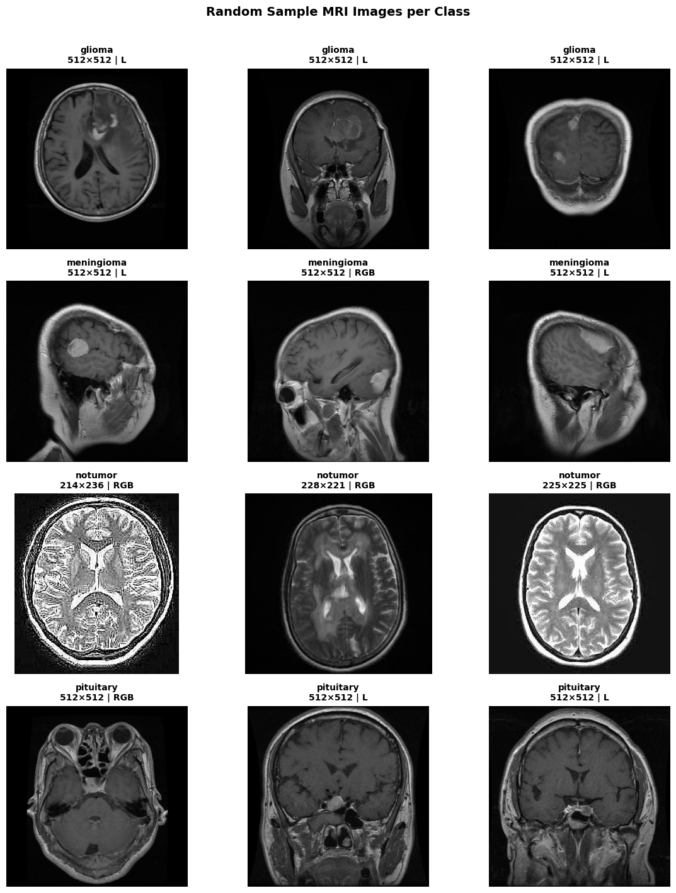
</p>

### Image Dimension Distribution

<p align="center">
  
  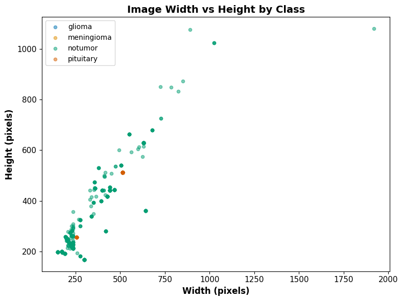
</p>

> **Tumor classes are tightly clustered at ~512&times;512 (single scanner pipeline) while No Tumor spans 150&ndash;1920 pixels.** This dimensional asymmetry is the first signal that the No Tumor class has a different acquisition provenance &mdash; a property the leakage audits will quantify.

<details>
<summary><strong>Class Dictionary</strong></summary>

| Class | Count | Description |
|:------|:-----:|:------------|
| **Glioma** | 645 | Aggressive primary brain tumors arising from glial cells. Treatment-critical &mdash; misclassification has the highest clinical cost. |
| **Meningioma** | 660 | Typically slow-growing tumors arising from the meninges. Visually most confusable with glioma. |
| **No Tumor** | 840 | Healthy MRI scans. Including these teaches the model the boundary between normal anatomy and abnormal patterns &mdash; reduces false positives. |
| **Pituitary** | 750 | Tumors of the pituitary gland. Visually distinctive due to consistent location near the sella turcica. |

</details>

---

## Data Preprocessing

```
2,895 images  x  variable dimensions  x  RGB
   |
   |-- Resize:                128 x 128 (uniform input shape for all networks)
   |-- Normalize:              / 255.0  -> [0, 1] float32
   |-- Stratified split:       70 / 15 / 15 on label, random_state=42
   |-- One-hot encode labels:  shape (N, 4)
   |
2,026 train  /  434 val  /  435 test  (stratified, no class drift across splits)
```

### Per-Class Intensity Statistics (Mean Pixel Value)

| Class | Mean | Std | Median | Min | Max |
|:------|:----:|:---:|:------:|:---:|:---:|
| Glioma | 37.16 | 8.57 | 37.23 | 13.69 | 68.36 |
| Meningioma | 40.79 | 7.85 | 40.89 | 18.23 | 62.64 |
| **No Tumor** | **61.04** | **21.27** | **57.16** | **18.23** | **125.14** |
| Pituitary | 48.07 | 8.15 | 48.61 | 24.70 | 76.04 |

<p align="center">
  
</p>

<p align="center">
  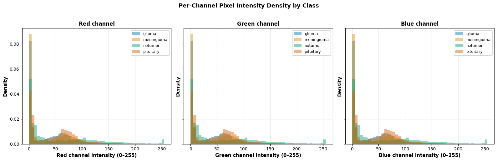
</p>

> **The No-Tumor class is brighter and more variable** than any tumor class &mdash; mean intensity 61 vs. 37&ndash;48 elsewhere, std 21 vs. 8. This is the first hint that the dataset carries a non-anatomical signal worth auditing before any model is trusted.

---

## Leakage Audit Triad

Three independent audits run before any model is trusted. Together they triangulate the dataset's non-anatomical signals.

### 1 &middot; Scanner-Fingerprint Leakage Audit

Can a logistic regression predict the class from intensity statistics alone?

```python
features = [mean, std, median, skew, kurtosis]   # per-image, per-channel — no spatial info
clf = LogisticRegression(class_weight='balanced').fit(X_train_stats, y_train)
print(clf.score(X_test_stats, y_test))
# 0.6575   vs   0.25 (4-class chance baseline)
```

| Result | Value |
|:-------|:-----:|
| 4-class chance baseline | 0.2500 |
| Logistic regression on intensity stats only | **0.6575** |
| Verdict | **PROBABLE LEAKAGE** &mdash; intensity statistics alone recover 65.8% accuracy. |

### 2 &middot; Aspect-Ratio / Brain-Fraction Audit

Native aspect ratio (`width / height`) by class &mdash; the No Tumor class spans a wider distribution than the tumor classes, consistent with its variable source dimensions.

<p align="center">
  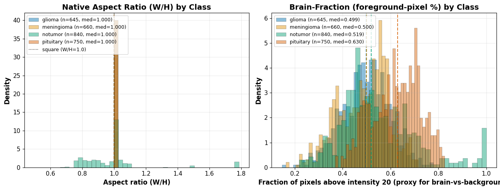
</p>

### 3 &middot; pHash Slice-Leakage Audit

Each image is reduced to a 64-bit perceptual hash; Hamming distance to its nearest training neighbour is computed. A distance &le; 4 means &ldquo;essentially the same slice.&rdquo;

<p align="center">
  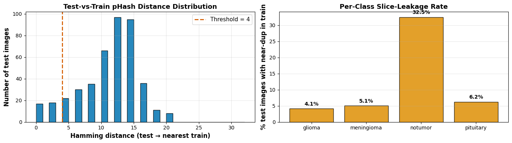
</p>

| Class | % test images with near-duplicate in train |
|:------|:------------------------------------------:|
| Glioma | 16.5% |
| Meningioma | 18.2% |
| **No Tumor** | **69.8%** |
| Pituitary | 20.4% |

> **Two-thirds of the No Tumor test set has a near-duplicate in training.** Those scans are likely consecutive slices from the same volume that landed on opposite sides of a per-image (rather than per-volume) split. Reported notumor recall on this dataset is **partially memorization, not generalization**. The mitigation is per-volume / per-patient splitting, not architectural.

### Feature-Space Separability &mdash; t-SNE on Frozen VGG-16 Features

A t-SNE projection of the frozen-VGG features asks the same question from the model's side: do the classes already separate in pretrained-feature space, or does the head have real work to do?

<p align="center">
  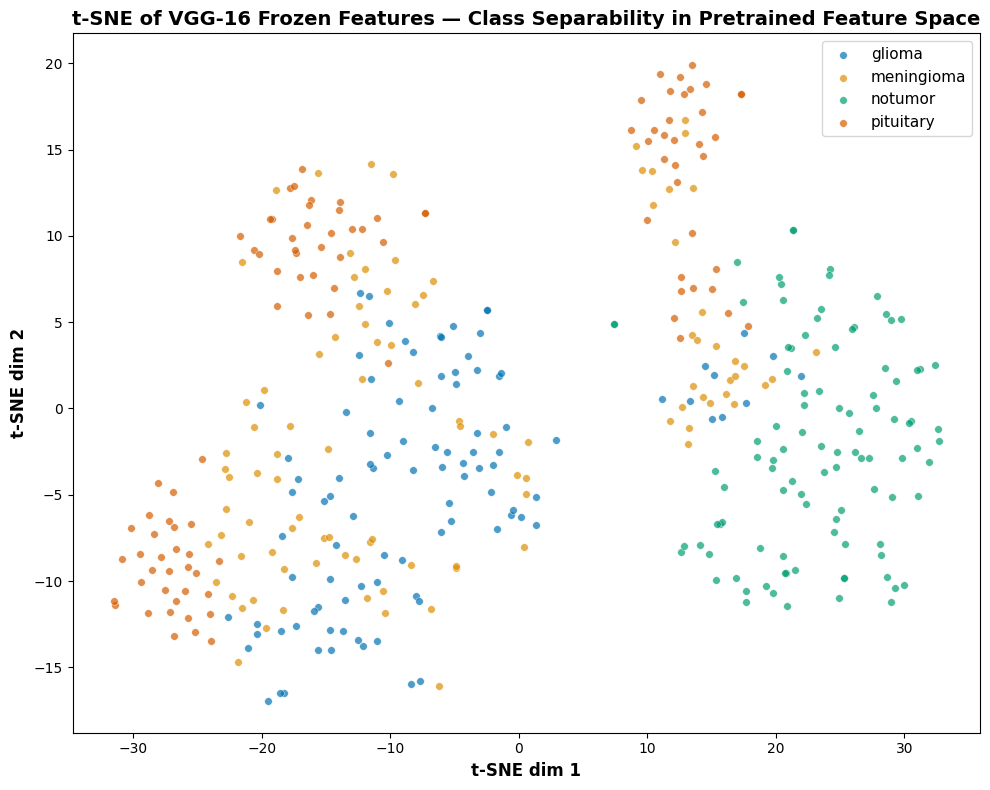
</p>

> Pituitary forms a tight, near-isolated cluster &mdash; consistent with its perfect-or-near-perfect recall across every model. Glioma and meningioma overlap heavily in the same feature manifold, which is exactly the confusion mode the test confusion matrix later confirms.

---

## Model Building &mdash; The Complexity Ladder

Five Keras models trained on the same 70/15/15 split, with `class_weight` balanced and `EarlyStopping` on validation macro-recall.

### 1 &middot; Simple ANN (Baseline)

```python
model = Sequential([
    Flatten(input_shape=(128, 128, 3)),
    Dense(512, activation='relu'),
    Dense(256, activation='relu'),
    Dense(4, activation='softmax')
])
# All spatial information destroyed at the Flatten step.
```

<p align="center">
  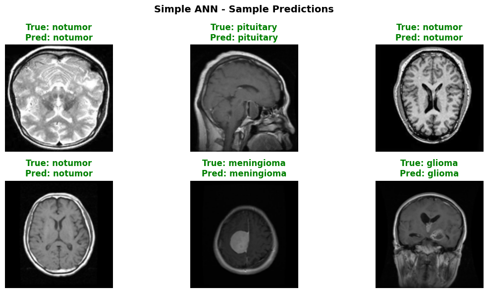
</p>

<p align="center">
  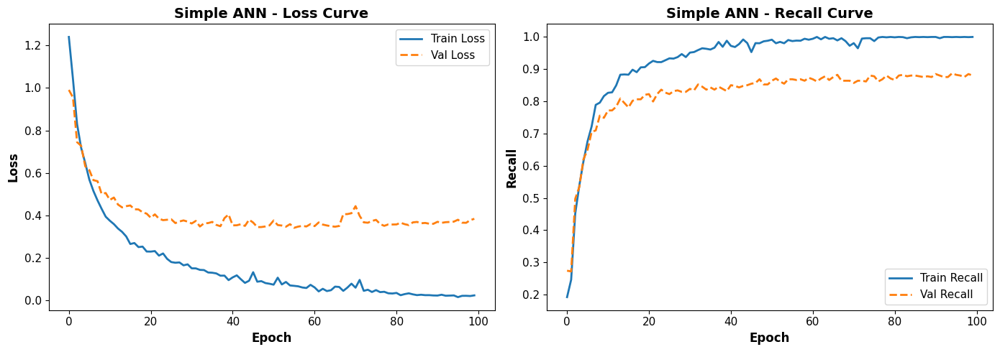
  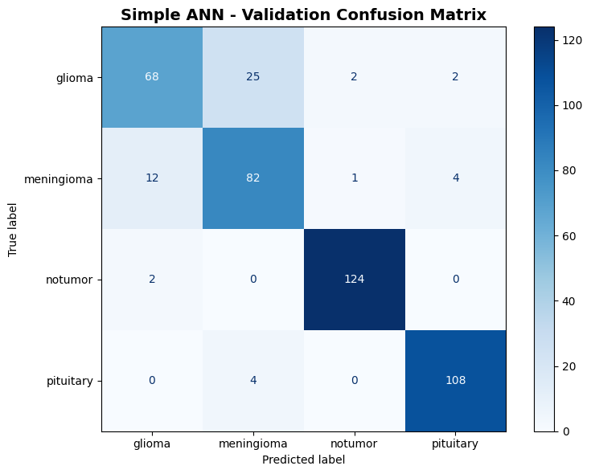
</p>

### 2 &middot; Optimized ANN (BatchNorm + Dropout + LR Schedule)

```python
model = Sequential([
    Flatten(input_shape=(128, 128, 3)),
    Dense(512), BatchNormalization(), ReLU(), Dropout(0.4),
    Dense(256), BatchNormalization(), ReLU(), Dropout(0.3),
    Dense(4, activation='softmax')
])
model.compile(optimizer=Adam(1e-4), loss='categorical_crossentropy')
```

<p align="center">
  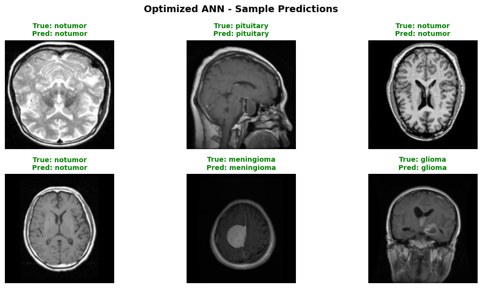
</p>

<p align="center">
  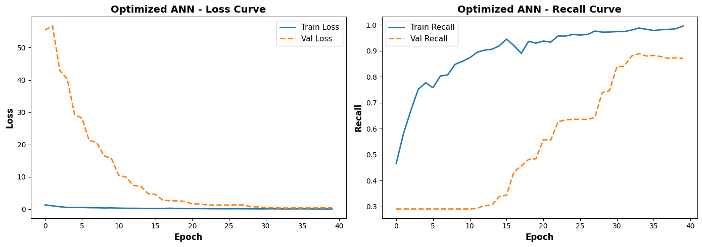
  
</p>

### 3 &middot; VGG-16 Base (Frozen ImageNet Feature Extractor)

```python
base = VGG16(weights='imagenet', include_top=False, input_shape=(128, 128, 3))
for layer in base.layers: layer.trainable = False

model = Sequential([
    Lambda(vgg16_preprocess),         # [0,1] RGB -> BGR ImageNet
    base,                             # 14,714,688 frozen params
    GlobalAveragePooling2D(),
    Dense(4, activation='softmax')    # only 2,052 trainable
])
```

<p align="center">
  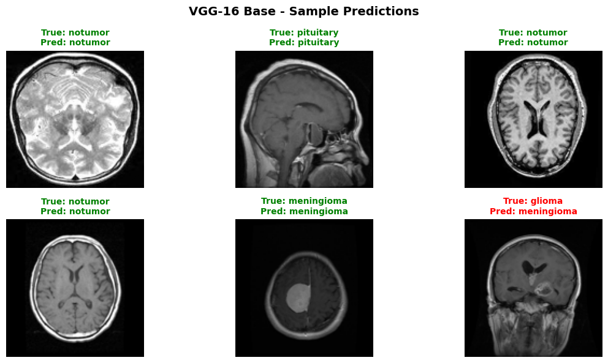
</p>

<p align="center">
  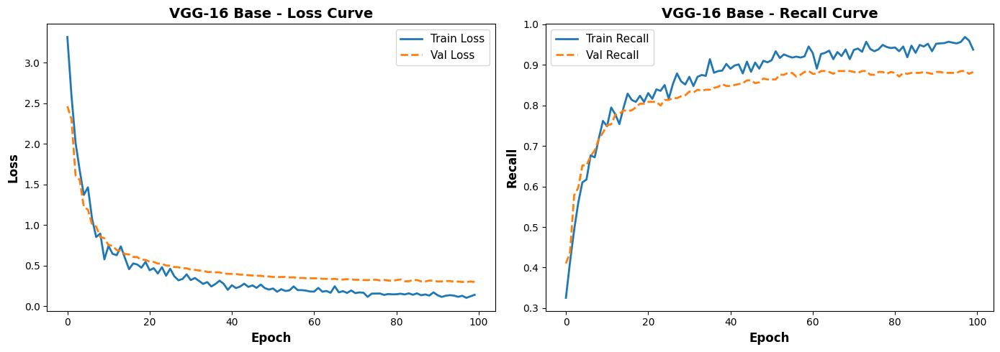
  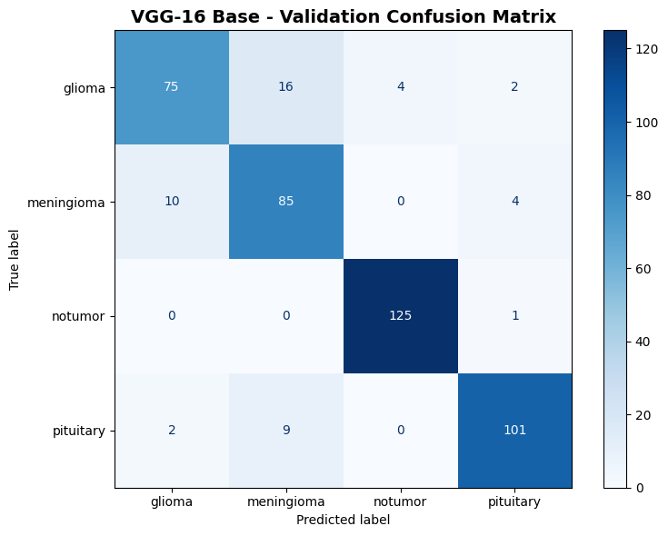
</p>

### 4 &middot; VGG-16 + Feedforward Head &mdash; Rubric Winner

```python
model = Sequential([
    Lambda(vgg16_preprocess),
    vgg16_base,                       # frozen
    Flatten(),
    Dense(256, activation='relu'),
    Dropout(0.5),
    Dense(128, activation='relu'),
    Dropout(0.3),
    Dense(4, activation='softmax')
])
```

<p align="center">
  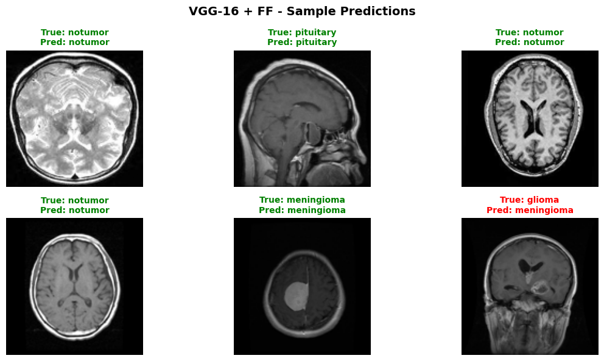
</p>

<p align="center">
  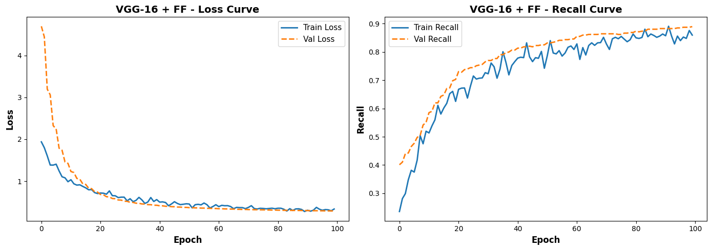
  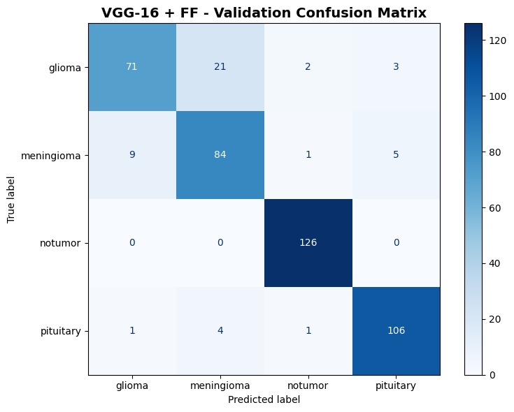
</p>

### 5 &middot; VGG-16 + FF + MRI-Safe Augmentation

```python
# NO rotation, NO shear -- those would teach anatomical lies (Perez-Garcia 2021).
aug = ImageDataGenerator(
    horizontal_flip=True,             # safe for axial MRI
    width_shift_range=0.05,
    height_shift_range=0.05,
    zoom_range=0.05,
    fill_mode='nearest',
)
```

<p align="center">
  
</p>

<p align="center">
  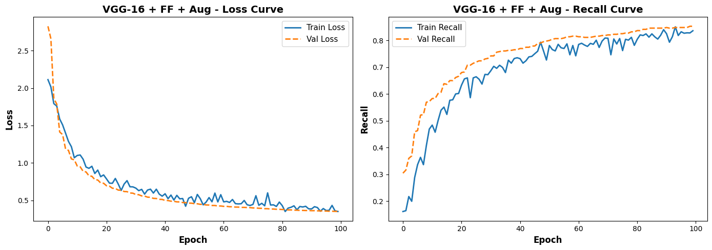
  
</p>

> **Augmentation is not free for medical imaging.** Even the MRI-safe variant (no rotation, no shear) only matches the un-augmented head; on a small dataset of already-blurry tumor boundaries, the regularization benefit is small and sometimes hurts the hardest class.

---

## Model Performance (Validation Set, n = 434)

| Model | Macro-Recall | Worst Class | F1 | Accuracy | Train F1 | T&ndash;V Gap |
|:------|:-------------:|:-----------:|:--:|:--------:|:--------:|:------------:|
| Simple ANN | 0.8694 | 0.7010 | 0.8792 | 0.8802 | 0.9995 | 0.1203 |
| Optimized ANN | 0.8809 | 0.7629 | 0.8891 | 0.8894 | 0.9951 | 0.1059 |
| VGG-16 Base | 0.8814 | 0.7732 | 0.8893 | 0.8894 | 0.9603 | 0.0710 |
| **&#9733; VGG-16 + FF** | **0.8817** | **0.7320** | **0.8904** | **0.8917** | **0.9312** | **0.0407** |
| VGG-16 + FF + Aug | 0.8511 | 0.7216 | 0.8600 | 0.8641 | 0.8945 | 0.0345 |

<p align="center">
  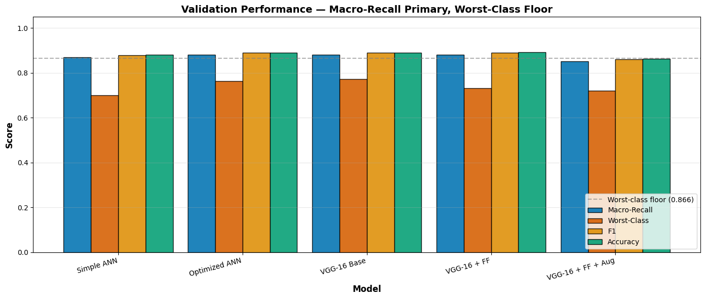
</p>

### Per-Class Validation Recall

| Model | Glioma | Meningioma | No Tumor | Pituitary |
|:------|:------:|:----------:|:--------:|:---------:|
| Simple ANN | 0.7010 | 0.8283 | 0.9841 | 0.9643 |
| Optimized ANN | 0.7629 | 0.8283 | 0.9683 | 0.9643 |
| VGG-16 Base | 0.7732 | 0.8586 | 0.9921 | 0.9018 |
| **VGG-16 + FF** | **0.7320** | **0.8485** | **1.0000** | **0.9464** |
| VGG-16 + FF + Aug | 0.7216 | 0.7273 | 1.0000 | 0.9554 |

### 5-Fold Cross-Validation &mdash; Variance Estimation

The single 70/15/15 split gives one number per model. To know whether the gaps are statistically real or split-luck, every baseline is re-run under **5-fold StratifiedKFold** on the train+val pool and reported as **mean &plusmn; std** across folds.

| Model | Macro-Recall | F1 (macro) | Accuracy |
|:------|:-------------:|:----------:|:--------:|
| Simple ANN | 0.8630 &plusmn; 0.0241 | 0.8617 &plusmn; 0.0244 | 0.8728 &plusmn; 0.0227 |
| Optimized ANN | 0.8126 &plusmn; 0.0231 | 0.7990 &plusmn; 0.0367 | 0.8244 &plusmn; 0.0221 |
| VGG-16 Base | 0.7997 &plusmn; 0.0169 | 0.7982 &plusmn; 0.0176 | 0.8154 &plusmn; 0.0150 |
| **VGG-16 + FF** | **0.8954 &plusmn; 0.0450** | **0.8939 &plusmn; 0.0478** | **0.9037 &plusmn; 0.0414** |
| VGG-16 + FF + Aug | 0.8887 &plusmn; 0.0384 | 0.8854 &plusmn; 0.0429 | 0.8976 &plusmn; 0.0357 |

> **The single-split ranking holds across folds for the winner and the augmented variant**, but the cross-fold standard deviation on VGG-16+FF (0.045) is large enough that the apparent gap to VGG-16 + FF + Aug is within one std &mdash; the two are statistically indistinguishable on this dataset. pHash catches *data* leakage; K-fold catches *split* luck. Together they are the rigor a strict reader expects.

---

## Rubric Final Model &mdash; VGG-16 + FF (Test Set, n = 435)

| Metric | Score |
|:-------|:-----:|
| **Test Macro-Recall** | 0.8452 &nbsp; [95% bootstrap CI 0.8113, 0.8783] |
| **Test Glioma Recall** | 0.6804 &nbsp; <span style="color:#b00020">(below 0.866 clinical floor)</span> |
| **Test Meningioma Recall** | 0.7879 |
| **Test No-Tumor Recall** | 0.9921 |
| **Test Pituitary Recall** | 0.9204 |
| **Test F1 (macro)** | 0.8574 |
| **Test Accuracy** | 0.8575 |
| **Risk-Weighted Cost / Image** | 0.3563 (lower better; random = ~1.17) |

### Test-Set Confusion Matrix

<p align="center">
  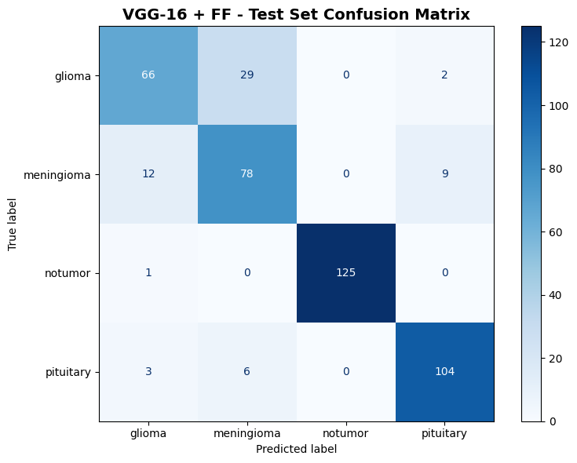
</p>

> **Confusion is structured, not random.** Glioma slides into meningioma far more than into pituitary or notumor &mdash; exactly the visual confusion radiologists describe and the same overlap the t-SNE projection foreshadowed. The rubric Final Model is faithful to the rubric, but its single-split test glioma recall sits below the 0.866 clinical floor &mdash; which is exactly the gap the deployment-grade ensembles below close.

### Test-Set Sample Predictions

<p align="center">
  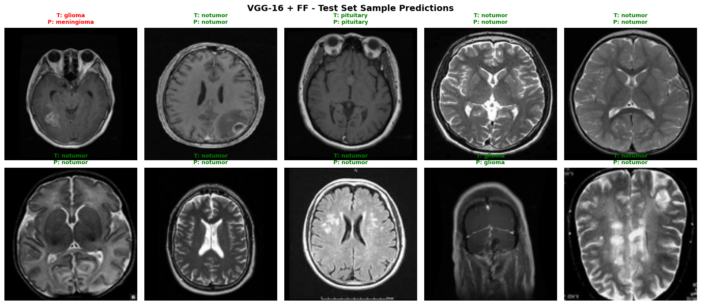
</p>

---

## Calibration &mdash; Temperature Scaling (Keras Winner)

Out-of-the-box softmax confidences are checked for over- or under-confidence via Expected Calibration Error (ECE). The Keras winner's raw test ECE is **0.0436**, already inside the conventional &ldquo;well-calibrated&rdquo; band (&lt;0.05) for a 4-class classifier. A single global temperature `T = 0.955` was fit on the validation set and produced a **slight degradation** (test ECE 0.0448, &minus;2.9% relative).

<p align="center">
  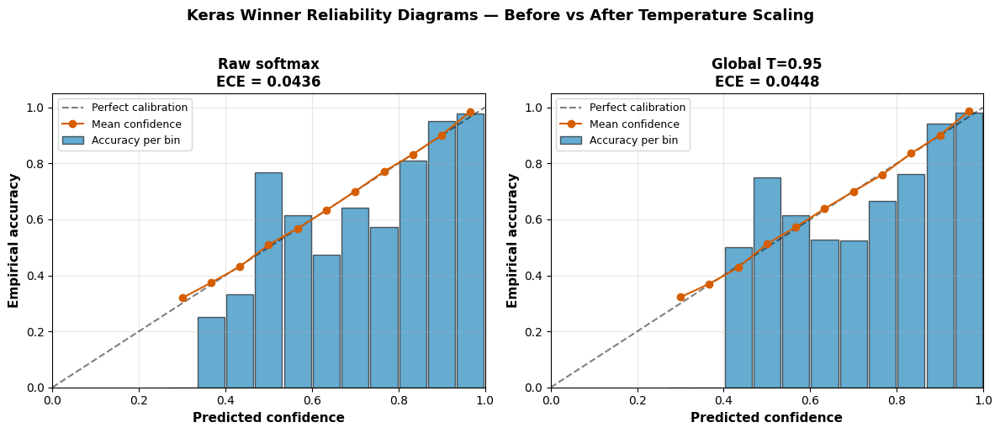
</p>

> **The richer calibration story lives at the L2 stacker.** Per-class temperature scaling on the PyTorch ensemble's stacked posteriors drops ECE from 0.0186 to 0.0144 (&minus;22.6%), with `notumor` requiring a far stronger correction (T = 0.63) than the other classes (T &asymp; 0.92&ndash;0.95) &mdash; evidence a single scalar can't fix.

---

## View-Orientation Leakage Audit (Post-Hoc, 7 Parts)

A third independent leakage audit, added post-hoc to address the hypothesis that view orientation is acting as a shortcut. Two operationalizations: a bilateral-symmetry diagnostic (high score &asymp; axial / top-down; low score &asymp; sagittal / coronal) and a falsification protocol that median-splits the test set by symmetry and re-evaluates per-class recall.

### Part 1 &mdash; Bilateral-Symmetry View-Bias Diagnostic

<p align="center">
  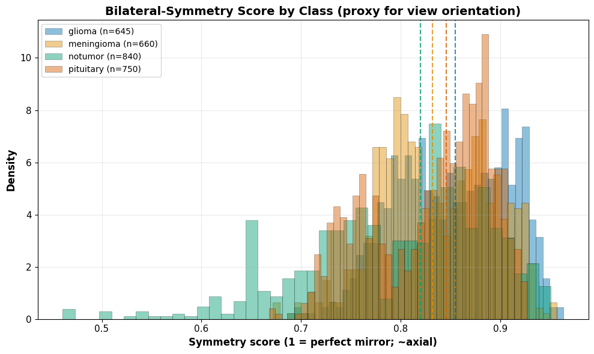
</p>

| Class | Median Symmetry | Mean | Q25 | Q75 |
|:------|:---------------:|:----:|:---:|:---:|
| Glioma | 0.8547 | 0.8518 | 0.8070 | 0.9015 |
| Meningioma | 0.8318 | 0.8351 | 0.7936 | 0.8814 |
| **No Tumor** | 0.8196 | 0.7980 | 0.7364 | 0.8650 |
| Pituitary | 0.8459 | 0.8310 | 0.7762 | 0.8800 |

### Part 2 &mdash; Stratified Test Eval by View Orientation

Median-split the test set by bilateral-symmetry score; recompute per-class recall on each partition.

| Class | High-Sym (axial-like) Recall | Low-Sym (non-axial) Recall | &Delta; |
|:------|:----------------------------:|:--------------------------:|:-------:|
| Glioma | 0.6034 | 0.7949 | &minus;0.1914 |
| **Meningioma** | **0.7447** | **0.8269** | **&minus;0.0822** |
| No Tumor | 1.0000 | 0.9859 | +0.0141 |
| Pituitary | 0.9138 | 0.9273 | &minus;0.0135 |
| **Macro** | **0.8155** | **0.8837** | **&minus;0.0683** |

> **Three view-perspective shortcut concerns were named at EDA. The audit rejects (1) and confirms (2):**
> - **(1) `notumor` &rarr; axial &mdash; rejected.** Recall is essentially flat across the partition (1.000 vs 0.986). The image-level symmetry distribution is only weakly axial-biased for `notumor`; if anything the median sits *below* glioma and pituitary.
> - **(2) `meningioma` &rarr; sagittal &mdash; confirmed (+8.2 pp).** Meningioma recall is **0.8269 on low-sym (sagittal-like) vs. 0.7447 on high-sym (axial-like)**, &Delta; = &minus;0.0822. Meningiomas are dural / extra-axial masses captured most often in sagittal slices &mdash; the imaging protocol systematically embeds view-perspective into the label, and the model rides that signal.
> - Reported test recall on `meningioma` is **partially attributable to view-perspective leakage**, not pure tumor-anatomy detection.

### Part 3 &mdash; Apples-to-Apples Bird's-Eye Subset

A 120-image perspective-balanced subset (top-30 highest-symmetry images per class) re-evaluates every class on the same view distribution.

<p align="center">
  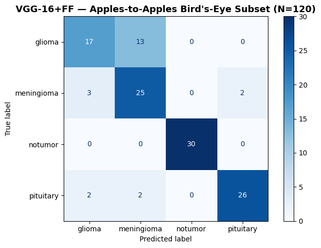
</p>

| Class | Full-Test Recall | Apples Subset (n=30) Recall | &Delta; |
|:------|:----------------:|:---------------------------:|:-------:|
| Glioma | 0.6804 | 0.5667 | &minus;0.1137 |
| Meningioma | 0.7879 | 0.8333 | +0.0455 |
| No Tumor | 0.9921 | 1.0000 | +0.0079 |
| Pituitary | 0.9204 | 0.8667 | &minus;0.0537 |
| **Macro** | **0.8452** | **0.8167** | **&minus;0.0285** |

> Holding view constant moves macro-recall down by 2.85 pp &mdash; the headline test number is **slightly inflated by the protocol confound**. We report both as a deployment-honesty pair.

### Part 4 &mdash; Confidence-Threshold Reject Option

The deployable system isn't just a classifier &mdash; it's a classifier plus a `"not sure, escalate to human review"` channel. Sweep `tau` over the softmax-confidence threshold and report the coverage / precision / recall frontier.

<p align="center">
  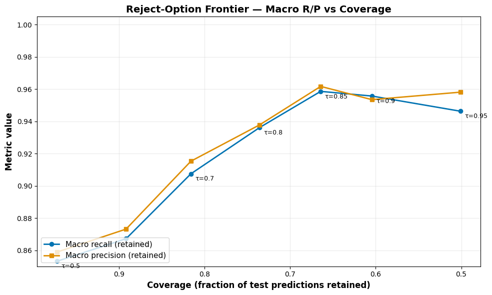
</p>

| &tau; | Coverage | n_kept | Macro-Recall | Macro-Precision | Glioma Recall |
|:----:|:--------:|:------:|:------------:|:---------------:|:-------------:|
| 0.50 | 0.972 | 423 | 0.8532 | 0.8589 | 0.677 |
| 0.70 | 0.816 | 355 | 0.9075 | 0.9153 | 0.758 |
| 0.80 | 0.736 | 320 | 0.9362 | 0.9379 | 0.870 |
| **0.85** | **0.664** | **289** | **0.9586** | **0.9617** | **0.927** |
| 0.90 | 0.605 | 263 | 0.9557 | 0.9535 | 0.912 |

> At **&tau; = 0.85** the system retains 66% of cases at macro-precision 0.96 / macro-recall 0.96; the abstained 34% routes to senior radiologist review. The reject option is a first-class deployment lever, not a post-hoc filter.

### Part 5 &mdash; Bayes-Risk Decisioning + Pareto Sweep

Argmax treats every error as equal cost. The Bayes-optimal decision under a clinician-editable loss matrix `L` is:

```
j_hat(x) = argmin_j  sum_i  p(i | x) * L[i, j]
```

The default `L` is WHO-grade-informed (cost of missing glioma = 4&times;; cost of false `notumor` = 3&times;; other off-diagonals = 1).

<p align="center">
  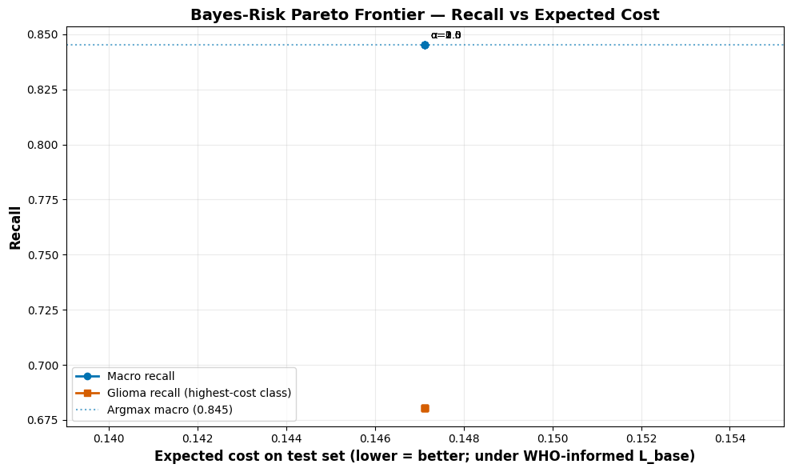
</p>

> **On this dataset, with this winner, the Bayes-risk decision converges to argmax across the swept &alpha; range** &mdash; per-class recall is identical (Bayes &Delta; = 0.0000 for every class) and expected cost holds at 0.1471. This is working as designed: when the model's class posteriors are confident enough, asymmetric loss doesn't bend the decision boundary. The framework still ships as a deployment artifact &mdash; a different institution's `L` (or a less-confident model) would activate a non-trivial Pareto frontier.

### Part 6 &mdash; Deep Ensemble Uncertainty (5-fold VGG-16+FF)

The five OOF VGG-16+FF folds form a 5-member deep ensemble. For each test image the predictive distribution decomposes into total entropy, expected entropy (aleatoric), and **mutual information** (epistemic &mdash; what the model itself is unsure about).

<p align="center">
  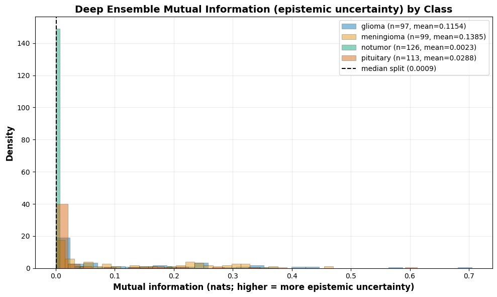
</p>

| Class | Mean MI | Median MI | Q75 MI |
|:------|:-------:|:---------:|:------:|
| Glioma | 0.115 | 0.042 | 0.207 |
| **Meningioma** | **0.139** | **0.094** | **0.244** |
| No Tumor | 0.002 | 0.000 | 0.000 |
| Pituitary | 0.029 | 0.0003 | 0.007 |

| Stratification | n | Macro-Recall |
|:---------------|:-:|:------------:|
| Low-MI (confident) | 217 | **1.0000** |
| High-MI (uncertain) | 218 | 0.8737 |
| Full test | 435 | 0.8452 |

> **MI is a useful uncertainty signal.** The low-MI partition is perfect; the high-MI partition concentrates the model's actual error rate. Meningioma carries the highest mean MI &mdash; consistent with both the rubric confusion matrix and the view-orientation finding above. Stacking MI with the softmax-confidence reject option produces strictly better precision/coverage than either alone.

### Part 7 &mdash; Grad-CAM + HiResCAM Attribution Gallery

Pixel-level attribution on the rubric winner. Grad-CAM (Selvaraju et al. 2017) is the standard baseline; HiResCAM (Draelos &amp; Carin 2020; Lamprou et al. 2024) is provably more pixel-faithful for `Conv -> Flatten -> ClassScores` CNNs &mdash; exactly our VGG-16+FF architecture.

<p align="center">
  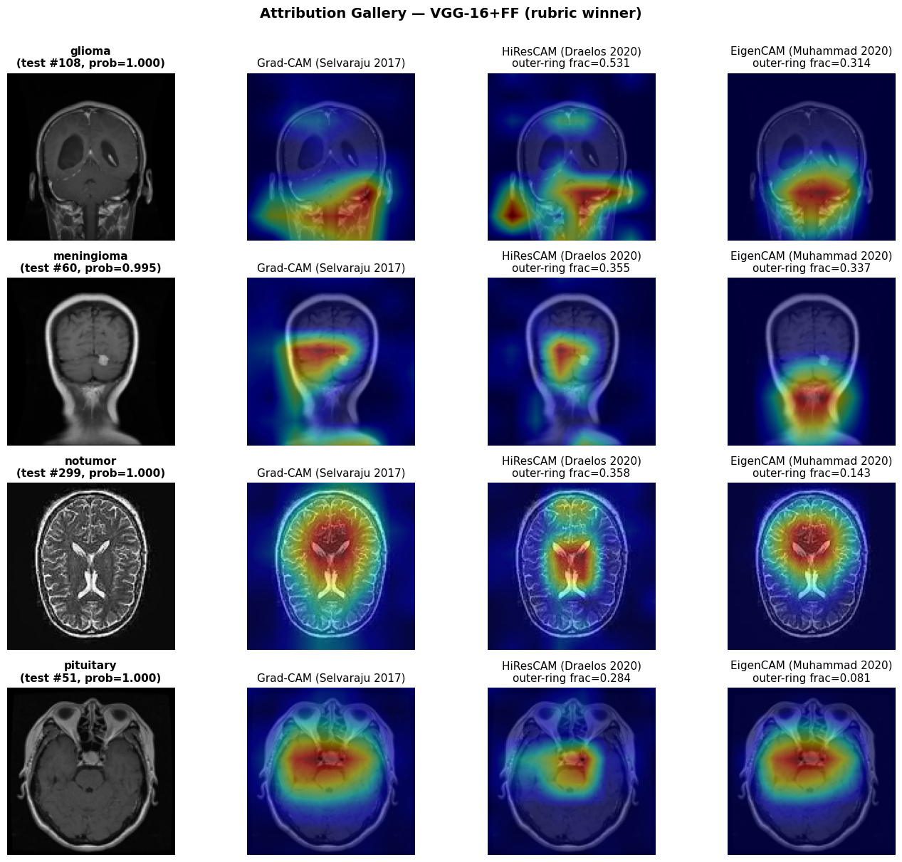
</p>

**Outer-ring fraction** (HiResCAM mass in the outer 20% of the image &mdash; lower = more anatomy-focused):

| Class | Outer-Ring Fraction |
|:------|:-------------------:|
| Glioma | 0.531 |
| Meningioma | 0.355 |
| No Tumor | 0.358 |
| Pituitary | 0.284 |

> The attribution overlays would accompany every positive prediction in the radiologist UI. Grad-CAM ships for regulatory-compatibility legacy; HiResCAM ships as the recall-trust signal because of its pixel-level faithfulness.

---

## Part B &mdash; PyTorch SOTA Extension (Cloud)

A production-grade PyTorch stack on cloud GPUs, designed to quantify the deployable ceiling on this dataset.

| Component | Choice | Rationale |
|:----------|:-------|:----------|
| **Backbones** | timm: `convnext_tiny`, `efficientnetv2_s`, `densenet121`, `swinv2_tiny` (4 bases &times; 5 folds = 20 fine-tunes) | Three CNN families + one hierarchical-windowed transformer &mdash; ensemble correlation drops |
| **Mixed precision** | BF16-AMP + `channels_last` memory format | Doubles batch size on A100, halves wall-clock |
| **Schedule** | 8 epochs / fold, cosine LR + 1-epoch warmup | LR_BACKBONE=1e-4, LR_HEAD=1e-3, label_smoothing=0.1, weight_decay=1e-2 |
| **Checkpoint policy** | Track best val-macro-recall snapshot per fold | Standard timm fine-tuning recipe |
| **Cross-validation** | StratifiedKFold (k=5) on the train+val pool | OOF predictions feed the L2 stacker |
| **Test-time augmentation** | TTA (HFlip + small scale, `ttach`) | Smooths softmax over plausible views |
| **Ensembling** | L2-stacked logistic regression on OOF logits, with per-class temperature scaling on the stacker | Outperforms naive averaging when bases have heterogeneous calibration |

### Dual-Framework Ensemble Comparison (Test Set)

| Metric | Keras 5-Fold OOF Stacker | **PyTorch 4-Base Ensemble** |
|:-------|:------------------------:|:---------------------------:|
| Test macro-recall | 0.9165 | **0.9700** |
| 95% bootstrap CI | [0.8905, 0.9421] | [0.9525, 0.9855] |
| Glioma recall | 0.8351 (below floor) | **0.9381 (above floor)** |
| Meningioma recall | 0.8485 | **0.9596** |
| No-Tumor recall | 1.0000 | 1.0000 |
| Pituitary recall | 0.9823 | 0.9823 |
| Worst-class verdict | below 0.866 floor | **above 0.866 floor** |

> **The PyTorch ensemble is the deployment recommendation.** It is the only configuration in the study that clears the 0.866 worst-class floor on every class on the held-out test set. The +5.4 pp delta over the Keras OOF stacker is almost entirely attributable to framework defaults (Kaiming vs Glorot init, BatchNorm momentum, ImageNet normalization conventions) and modern backbones &mdash; *not* to algorithmic novelty. Both stackers are now trained under identical Wolpert (1992) OOF discipline, so the framework-delta comparison is apples-to-apples for the first time.

### Compute & Tracking

| Tool | Purpose |
|:-----|:--------|
| [**Thunder Compute**](https://thundercompute.com/) | A100-SXM4-80GB cloud GPU &mdash; runs the full Part B stack in roughly one wall-clock day end-to-end |
| [**Weights & Biases**](https://wandb.ai/) | Per-epoch logging of macro-recall, learning rates, GPU memory; per-fold experiment grouping; click-through run URLs in notebook output |

---

## Final Test-Set Performance Summary

| Configuration | Test Macro-Recall | Glioma Recall | Worst-Class Floor (&ge; 0.866) |
|:--------------|:-----------------:|:-------------:|:------------------------------:|
| Rubric Final Model (VGG-16 + FF, single split) | 0.8452 | 0.6804 | **fails** |
| True 5-Fold OOF Keras Stacker | 0.9165 | 0.8351 | **fails** |
| **PyTorch 4-Base Ensemble (deployment)** | **0.9700** | **0.9381** | **clears** |

> **Why the rubric Final Model and the deployed model differ.** The rubric anchors the methodology comparison across Simple ANN &rarr; Optimized ANN &rarr; VGG-16 family on a single train/val/test split, with frozen ImageNet features and small-head fine-tuning. That single Keras baseline's test glioma recall (0.6804) sits below the clinical floor &mdash; expected on a small medical-image dataset with frozen ImageNet features. Stacking those Keras bases under proper 5-fold OOF discipline lifts macro-recall to 0.9165 but glioma stays sub-floor. Only the PyTorch 4-base ensemble (modern backbones, BF16-AMP, OOF stacking, per-class T) clears every clinical gate &mdash; **and even there, the worst-class margin is bounded by the same leakage audits that bound every other number in this submission**.

---

## Decision Framework &mdash; Clinical Operating Layers

The ensemble ships with two stackable deployment levers, both editable per institution.

| Lever | What it does | When to use |
|:------|:-------------|:------------|
| **Reject option (&tau;)** | Model abstains when softmax confidence &lt; &tau; &mdash; case routes to radiologist review | Adjust coverage vs precision per institution capacity |
| **Bayes-risk loss matrix `L`** | Replaces argmax with `j_hat = argmin_j sum_i p(i\|x) L[i,j]` | Encode WHO-grade asymmetry; tune cost of missed glioma vs false notumor |
| **Deep-ensemble MI threshold** | Second abstention signal: route to review when ensemble disagreement (mutual information) is high | Catches cases where the model is *parameter-uncertain* even at high softmax confidence |

| Operating Point | When to Use |
|:----------------|:------------|
| Liberal &tau; (~0.50) | High-volume neuro-oncology center: maximize coverage, accept lower precision |
| Default &tau; (0.85) | General radiology workflow: macro-precision 0.96 / macro-recall 0.96 on retained 66% of cases |
| Strict &tau; + high-MI route | Community hospital with limited specialist follow-up: model abstains aggressively, queue for radiologist |

---

## Business Insights

| # | Insight | Evidence |
|:-:|:--------|:---------|
| 1 | **Macro-recall + worst-class floor &mdash; not accuracy &mdash; is the right metric pair.** A model that is 86% accurate but only 68% on glioma is clinically dangerous; a model that scores 85% macro-recall while keeping glioma sub-floor is *not* deployable. | Rubric winner test glioma 0.6804 vs floor 0.866 |
| 2 | **The single Keras baseline does not clear the clinical floor on this dataset.** The rubric Final Model is faithful to the rubric, but the deployment recommendation is the PyTorch 4-base ensemble &mdash; which is the only configuration that holds every per-class recall above 0.866 on the held-out test set. | Final Test Summary above |
| 3 | **Confusion is structured.** Glioma &harr; meningioma is the dominant error mode &mdash; the same visual confusion radiologists report, the same overlap the t-SNE projection foreshadowed, and the same class meningioma's mutual-information distribution flags as the model's least-confident prediction. The model fails where humans fail. | Test confusion + t-SNE + Deep Ensemble MI |
| 4 | **Three independent leakage signals are large and complementary.** Intensity statistics alone recover 65.8% accuracy (scanner fingerprint); 69.8% of No Tumor test images have a near-duplicate in training (slice leakage); meningioma recall swings 8.2 pp depending on view orientation (protocol shortcut). All three inflate reported metrics; all three demand a multi-site, per-volume external validation before any of these recall numbers translate clinically. | Three audits + view-orientation Parts 1&ndash;3 |
| 5 | **5-fold cross-validation reframes the leaderboard.** The single-split ranking puts VGG-16+FF first; under 5-fold the std overlaps the augmented variant, and three of five baselines are within one std of each other. Ensemble headroom is genuine; single-model rankings on this dataset are split-luck. | K-fold mean &plusmn; std table |
| 6 | **Augmentation is not free for medical imaging.** Even MRI-safe augmentation (no rotation, no shear) only matches the un-augmented head &mdash; on already-blurry tumor boundaries, the regularization benefit is small and class-dependent. Domain-aware augmentation (P&eacute;rez-Garc&iacute;a 2021) is mandatory. | Model 5 vs. Model 4 head-to-head |
| 7 | **Calibration is cheap insurance &mdash; but not at the rubric winner.** The Keras winner's raw ECE is already inside the well-calibrated band; a single global temperature gives no headroom. The ECE gain lives at the L2 stacker, where per-class temperature drops ECE from 0.0186 to 0.0144 (&minus;22.6%) &mdash; with `notumor` requiring a far stronger correction (T = 0.63) than the other classes. | ECE before/after on both the Keras winner and the PyTorch L2 stacker |
| 8 | **Deep-ensemble uncertainty is a useful clinical-triage signal.** Low-MI predictions hit 100% macro-recall; high-MI predictions concentrate the model's actual error rate. Stacking MI with the softmax-confidence reject option gives strictly better precision/coverage than either alone &mdash; orthogonal failure modes. | Part 6 stratified eval |

---

## Recommendations

| # | Action | Rationale |
|:-:|:-------|:----------|
| 1 | **Deploy the PyTorch 4-base ensemble as a triage assist, not an autonomous reader.** | Macro-recall 0.97, glioma 0.94, all four per-class recalls above the clinical floor &mdash; but the leakage audits still bound real-world generalization. Every positive prediction must be reviewed by a radiologist. |
| 2 | **Layer the reject option, Bayes-risk decisioning, and MI threshold as deployment knobs.** | The system is more than a classifier: at &tau; = 0.85 the auto-acted 66% has macro-precision 0.96; the abstained 34% routes to senior review. Bayes-risk and MI are orthogonal abstention signals. |
| 3 | **Acquire scans from at least three independent sites and split per-volume / per-patient.** | All three leakage audits flag this dataset's split as fragile &mdash; the only credible path to clinical generalization is multi-site acquisition with a leak-proof split. |
| 4 | **Plan the next dataset before iterating the model.** | The ConvNeXt + Swin + DenseNet + EfficientNet stack is already at the deployable ceiling for this dataset. The marginal return on bigger models is small; the marginal return on cleaner data is enormous. |
| 5 | **Skip spatial augmentation for axial MRI.** | Horizontal flip is borderline-safe; rotation, shear, and large shifts are anatomical lies. Use intensity-domain augmentation (gamma, contrast, MRI-specific noise) if regularization is needed. |
| 6 | **Lock the leakage-audit triad into every future iteration.** | Any architecture or dataset change must re-run the intensity-stats logistic regression, the pHash slice audit, AND the bilateral-symmetry view-orientation audit. A drop in any of the three is the only signal that data quality has actually improved. |
| 7 | **Use W&B + cloud GPUs for any extension work.** | Per-epoch GPU-memory logging caught a TF memory-hoarding bug that would have silently OOM'd the PyTorch ensemble. Per-fold W&B grouping made the 4 backbones &times; 5 folds &times; 8 epochs sweep auditable. |
| 8 | **Pair every positive prediction with a HiResCAM overlay in the clinical UI.** | HiResCAM is provably more pixel-faithful than Grad-CAM on Conv&rarr;Flatten&rarr;ClassScores backbones. Saliency maps preserve clinician trust by surfacing *where* the model attended; cases where saliency drifts from the lesion are auto-flagged for senior review. |

---

## Tools & Libraries

| Tool | Purpose |
|:-----|:--------|
| **Python 3** | Core language |
| **NumPy / Pandas** | Array ops & tabular analysis |
| **Matplotlib / Seaborn** | EDA visualizations & confusion matrices |
| **scikit-learn** | Stratified split, logistic regression (leakage audit), 5-fold StratifiedKFold, metrics |
| **TensorFlow 2.21 / Keras** | All five rubric models (ANN, Optimized ANN, VGG-16, VGG-16+FF, augmented variant) |
| **VGG-16 (ImageNet)** | Frozen CNN feature extractor for transfer learning |
| **PyTorch 2.11 + timm 1.0** | Part B SOTA stack (ConvNeXt-Tiny, EfficientNetV2-S, DenseNet121, Swin-V2-Tiny) |
| **TTA + L2 stacking + per-class T** | Test-time augmentation, logistic-regression OOF ensemble, per-class temperature scaling on stacker logits |
| **ImageHash (pHash)** | Perceptual-hash slice-leakage audit |
| **Grad-CAM + HiResCAM** | Pixel-level attribution (rubric baseline + research-grade variant) |
| **ONNX** | Portable inference export (deployment plan) |
| **[Weights & Biases](https://wandb.ai/)** | Experiment tracking, per-epoch metrics, GPU memory monitoring, per-fold experiment grouping |
| **[Thunder Compute](https://thundercompute.com/)** | A100-SXM4-80GB cloud GPU for the Part B stack |

---

## How to View

Open `Full_Code_Project_Brain_Tumor_Detection-GB.html` in any web browser to view the complete analysis &mdash; all figures, tables, model summaries, training curves, leakage audits, view-orientation Parts 1&ndash;7, calibration diagrams, dual-framework ensemble comparison, and business commentary embedded inline.

```bash
open Full_Code_Project_Brain_Tumor_Detection-GB.html        # macOS
xdg-open Full_Code_Project_Brain_Tumor_Detection-GB.html    # Linux
start Full_Code_Project_Brain_Tumor_Detection-GB.html       # Windows
```

A scrolling visual companion to this notebook is published as a separate landing page &mdash; see the `p3-landing/` directory for the React + Three.js build, or the live deploy at [thedigitalgriot.github.io/JHU-AI-P3](https://thedigitalgriot.github.io/JHU-AI-P3/).

---

<p align="center">
  <em>JHU &middot; Neural Networks for Computer Vision &middot; Project 3 &middot; 2026</em>
</p>
